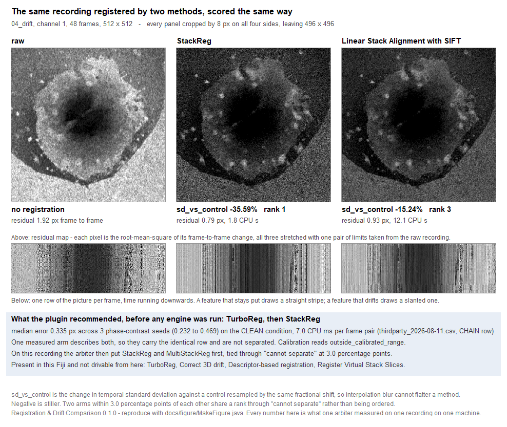

# Registration & Drift Comparison

[](LICENSE)

**Which registration method should I use on this movie, and did it work?**

Registration & Drift Comparison is an ImageJ/Fiji plugin that measures the movement in a time-lapse
stack, tells you whether it can be registered, names registration engines from measurements taken on
real recordings, and scores the result against a control that accounts for interpolation blur.

It installs as one jar with no extra update site. **It ships no registration engine of its own.**
Every engine it can run belongs to somebody else, is detected at run time, and is installed if you
ask for it and never otherwise.

---

## The engines it drives, and where each one comes from

This list is above the feature list on purpose. What this plugin depends on is part of the pitch,
not a caveat underneath it.

| Engine | Whose it is | How you get it | Measured calibration row | Compare mode drives it |
|---|---|---|---|---|
| **TurboReg** | Biomedical Imaging Group, EPFL | Its own update site, or one click here | **yes** | no — its menu entry opens a window and waits for a person. The whole-recording form of the same engine is StackReg |
| **StackReg** | Biomedical Imaging Group, EPFL | Its own update site, or one click here | **yes**, the same row | **yes** |
| **MultiStackReg** | Brad Busse, in Kota Miura's script-usable form | Its own update site, or one click here | no | **yes** |
| **Correct 3D drift** | Fiji | Part of the Fiji download | no | a recipe is written **and it did not run** — see Limitations |
| **Descriptor-based registration** | Fiji | Part of the Fiji download | no | no — it fuses a series into one image, which leaves a comparison nothing to score |
| **Register Virtual Stack Slices** | Fiji | Part of the Fiji download | no | no — it reads a folder of files and writes another, so an arm would write your recording to disk unasked |
| **Linear Stack Alignment with SIFT** | mpicbg, in Fiji | Part of the Fiji download | no | **yes** |
| **Image Stabilizer** | Kang Li | Manual download, last updated June 2009 | no | a recipe is written, and it has never been run here |
| **Fast4DReg** | CellMigrationLab | Its own update site, or one click here | no | no — macro files that ask their own questions and write into a folder |
| **NanoJ-Core** | Henriques lab | Its own update site, or one click here | no | no — a packaged class whose menu entry this build has not read |

Engine names are spelled as their authors spell them, because those strings are also what you type
into a search box. None of these is fetched to produce a diagnosis, and no macro option installs
anything: repairing a missing engine is a button somebody presses in a dialog they opened.

Every "no" in that last column is a sentence the plugin will say to you, with the reason in it,
rather than an engine quietly missing from a comparison. **Two of the ten carry a measured
calibration row, they carry the same one, and three have been driven and scored on real recordings.**
See Limitations.

---

## Limitations

Read this before the features. Every item is measured, and the measurement is in
[`VALIDATION.md`](VALIDATION.md) with the date, the machine and the run command beside it.

### The calibration is three frames

The recommendation table is built from a benchmark run on **three IncuCyte phase-contrast seed
frames**, 48 frames each, spanning localisability 0.017 to 0.160 measured at a 4 × 4 pixel mean,
under four constructed conditions. That sentence travels with every recommendation the plugin makes,
in the plugin, because three frames from one instrument is a narrow calibration and presenting what
it produces as a general recommendation would overstate it.

### Two of the ten engines carry a measured row, and it is one row

The benchmark drove **one** real registration plugin on those pixels: TurboReg, slice to slice,
which is what StackReg is. So **StackReg and TurboReg carry a measured calibration row and the other
eight do not**, and the two of them carry the *same* row, because one measurement produced both. The
plugin does not pretend it can separate them.

For the other eight engines, what this plugin offers is not a measured expectation. It is **the
comparison it runs on your own recording** — which is the more reliable route in any case, and is
what compare mode is for.

### A comparison has three engines to compare, not ten

Of the ten in the catalogue, **five carry a recipe for driving them** — StackReg, MultiStackReg,
Correct 3D drift, Linear Stack Alignment with SIFT and Image Stabilizer. The other five say why not,
in the table above and in the row you get back. Of those five:

- **Correct 3D drift cannot currently be driven.** It is on disk and the plugin finds it there, but
  its menu command is registered by Fiji's script framework rather than by ImageJ's plugin scan, so
  in the validation runs it reported `Unrecognized command` on all 36 arms it was dispatched into,
  every time, with the reason in its own row.
- **Image Stabilizer has a recipe and has never been run through it here.** No machine used in the
  validation had it installed.

So the comparison evidence in `VALIDATION.md` rests on **three engines, two of which are the same
algorithm** — StackReg and MultiStackReg both call TurboReg. On a Fiji with everything installed,
what you get is a comparison of three arms.

### Localisability is reported and is never thresholded

Localisability is how far frame-to-frame correlation falls when one frame is displaced a single
pixel — whether a one-pixel error is visible in these pixels at all. Every row reports it **with the
scale it was measured at** (`measured_at_bin`), and **nothing in the verdict reads it**, because at
no scale tested does a cut separate the recordings that register from the recordings that do not.
Rank correlation against the reduction in temporal standard deviation, over the twelve validation
recordings, was **+0.51, +0.50, +0.13 and −0.10 at bins 1, 2, 4 and 8**. A threshold (defect D12)
is deferred to 0.2.0: it needs localisability measured against registration outcome across
instruments and modalities, not twelve recordings from one. The confidence signal the verdict
actually routes on is agreement between the two independent estimators, which does order those
recordings. Evidence: [`docs/D12_MEASUREMENT.md`](docs/D12_MEASUREMENT.md).

### The WALK label is out of reach at the shipped window length

The sampler measures three windows of twelve consecutive frames. A synthetic pure random walk reads
`wander` **0.96 at K = 12** against a threshold of 2.5, and reaches 3.41 at K = 200 — twelve frames
of a random walk genuinely have not had time to wander anywhere. So `MotionLabel.Component.WALK` is
effectively unreachable in this release: no validation recording produced it, and none could. A trace
a full-recording survey calls a walk, this plugin calls jitter. The two are not in conflict; they are
one trace seen through windows of two lengths. The threshold was not lowered, because separating 0.96
from 0.66 would be fitting a number to two synthetic traces across a margin of 0.3.

### `DOMINANCE_MARGIN` is measured too narrow and was deliberately not widened

`motion_dominant` says which component of the movement dominates, and holds back a band around the
decision as `unclear`. Measured across five samplings of each of the twelve validation recordings,
**all twelve cross the decision under resampling**, and the margin each would need to hold its own
crossing back runs from **2.00 to 26.29, median 4.46**. The shipped 1.5 is below every one of them.

It was not widened. Fitting 26.29 to the worst of twelve recordings from one instrument is exactly
how D12 happened in the first place, and the median would still leave half of them uncovered. The
measurement says something stronger than any replacement number: a windowed sample cannot reproduce
which component dominates on any of these recordings. `motion_dominant` is a reported column and
nothing routes on it.

### The validation set is twelve recordings from one instrument

All twelve are IncuCyte phase contrast from one archive, and **one of them is longer than 48
frames**. Nothing here is evidence about fluorescence, confocal, light sheet, or any other
instrument's noise. Widening the calibration across instruments and modalities is the first item of
the next version and the narrowest real limitation this plugin has. There is also **no ground-truth
movement for any of those recordings**: two measurements agreeing means they agree, not that either
is right.

### The fingerprint measures translation, and nothing else

Two estimators, both measuring whole-field translation. A recording whose parts move differently —
rotation, scaling, a stage tilt, tissue deforming — is outside what the diagnosis describes. It will
still report numbers, and those numbers will be about the translation component.

### Batch parallelism is restricted to diagnose and recommend

A folder of recordings runs several at a time in `diagnose` and `diagnose_recommend`, and **one at a
time in `apply` and `compare`**, whatever worker count you ask for. That is measured rather than
cautious: ImageJ's `Interpreter.batchMode` is one public static boolean for the whole application
with no lock on it, and driving two engines through it at once was measured to leave batch mode **on**
after both arms had finished (every image opened for the rest of that session would be invisible), to
let an arm carry on driving with the switch already **off** (an engine opens a real window in your
face), and to make that arm's working recording **unfindable by title**, which is how every engine
driven through ImageJ's command table finds its input. The dialog says which of the two it is doing,
and changes the sentence with the mode.

### The author has a competing registration plugin

The author maintains a registration plugin of his own. It is **not** in the catalogue, it is **not**
named in any output, and it cannot be recommended by this build. Three measures keep the
recommendation worth reading, and none of them is a promise:

1. **This plugin ships no registration engine of its own.** Everything it can run belongs to somebody
   else.
2. **Its two estimators are published prior art** — phase correlation, and a pyramid
   sum-of-squared-differences search — ported deliberately rather than reused from the author's own
   work.
3. **A bytecode test enforces the separation.** `regdrift.diag` is scanned in compiled form and must
   reference nothing from any log-ratio criterion. The build fails if it does.

Every log-ratio arm in the bundled benchmark is excluded from the recommendation for a stated reason:
that engine has no update site, and an engine that cannot be installed is not a recommendation.

### Smaller ones, stated rather than buried

- **A comparison says least on the recordings that move least.** Every arm is scored inside one
  shared region — the part of the frame that is real in every frame of the recording's *own*
  movement, plus 2 px. On a recording that barely moves, that region is narrow, and an arm that put
  the content further out is reported without a figure. On 6 of the 12 validation recordings there
  were fewer than two comparable arms, so there was nothing to compare.
- **Hand it a multichannel hyperstack and you get a comparison with no numbers in it.** The engines
  this plugin drives align a stack plane by plane in stack order, so on three interleaved channels
  they align channel 3 of one frame onto channel 1 of the next. Every arm is refused a figure with
  its reason, and nothing is scored wrongly — but duplicate the channel you want measured first.
- **Batch has no menu item yet.** `regdrift.RegDriftBatch` runs a folder from Java and its dialog is
  built and tested, but no menu entry opens it in 0.1.0.
- **Linear Stack Alignment with SIFT does not put the content in the same place twice.** It matches
  features through a randomised search. Its ranking was stable across three identical runs on every
  recording where a ranking existed; on one recording it produced a figure on the third run and none
  on the first two.
- **Nothing here says an engine is good or bad.** Every figure is what one arbiter measured on one
  recording on one machine, against an interpolation-matched control.

---

## One figure



The same 48-frame recording, registered by two different methods, scored the same way. The top row is
a **residual map**: each pixel holds the root-mean-square of its own frame-to-frame change, so bright
means that pixel kept changing and dark means it settled. All three are stretched with one pair of
limits taken from the raw recording, so a darker panel is a stiller recording rather than a
differently scaled picture. The bottom row is one row of the picture per frame, time running
downwards — a feature that stays put draws a straight stripe, one that drifts draws a slanted one.

Beneath them is the recommendation the plugin made from its bundled calibration **before any engine
ran**, and above them the `sd_vs_control` figure the arbiter measured on this recording afterwards.
**The two do not name the same engine, and the figure says why**: one measured arm describes both
TurboReg and StackReg so they are ranked 1 and 2 on a row word for word identical, TurboReg is not
something this build drives on its own, and the arm that then won was StackReg — tied with
MultiStackReg, which is StackReg's engine with another front end on it. That gap between what the
calibration expected and what the arbiter measured is the reason compare mode exists.

Reproduce it with [`docs/figure/MakeFigure.java`](docs/figure/MakeFigure.java); the numbers it drew
are written beside it in `docs/figure/figure-data.txt`. It needs a Fiji with the two engines in it
and the twelve-recording library, which is not in this repository.

---

## What it does

- **Ranks the channels** by how well a one-pixel displacement can be detected in them — not by
  contrast or gradient, which picks the noisiest channel on photon-limited data.
- **Describes the movement**, separating a straight-line drift from frame-to-frame jitter from an
  abrupt knock, as an unordered set of components with a severity beside it.
- **Reaches a registrability verdict** before anything is registered, with an explicit
  *estimators disagree* outcome rather than an average of two untrustworthy numbers.
- **Names the engines the measurements support**, with the measured row each reason came from, an
  expected error, an expected CPU time, a copyable macro line, and a flag when your recording falls
  outside the calibrated range.
- **Offers to install what is missing**, with the download size shown and the file checked against a
  recorded SHA-1. Interactive and opt-in; no macro option reaches it.
- **Applies one engine** and hands back the registered stack.
- **Compares the engines you have** on your own recording and ranks what each of them did, with two
  arms within 3.0 percentage points of each other sharing a rank through *cannot separate* rather
  than being ordered.
- **Scores a registration somebody else made**, including one from a different plugin.
- **Raises a motion-preservation flag** when the recovered path suggests something other than the
  sample was tracked.
- **Runs a folder** from Java, one row per recording, deterministic across worker counts.
- **Records macros, runs headless, and has a public Java API.**

Segmentation is not involved at any point. The plugin takes an intensity time series and nothing
else — no label images, no ROI sets, no calibration — and reports displacements in pixels.

### The measurement is cheap and stays cheap

The fingerprint measures **three windows of twelve consecutive frames** plus a bridge pair across
each gap, rather than every consecutive pair. Measured: a 48-frame 768 × 768 recording costs 4.56 s
of processor time and a **500**-frame 1024 × 1024 recording costs 5.09 s — **12% more CPU for ten
times the recording**, and all of that 12% is the larger frames. A whole diagnosis of a real
768 × 768 × 48 recording fits inside half a gigabyte of heap.

---

## Installation

Drop `RegistrationDriftComparison-0.1.0.jar` into `Fiji.app/plugins/` and restart Fiji.

One jar, no prerequisites. The registration plugins it drives are detected at run time; none of them
is needed to install this one, and none is needed to diagnose a recording or to get a recommendation.
On a Fiji with no candidate engine installed at all, diagnose and recommend complete, every engine is
marked `installed=no`, nothing is downloaded and nothing is written — that is checked in the test
suite with a proxy in front of the whole process.

There is no update site for this plugin. See [`PUBLISHING_AUDIT.md`](PUBLISHING_AUDIT.md) for what
distribution steps are outstanding and why none of them has been taken.

### Build from source

```
JAVA_HOME=<a JDK> bash mvnw clean package -Denforcer.skip=true
```

`net.imagej:ij` is the sole runtime dependency. Two modules — `oc3d-core` and `autofix-core` — are
compiled in at build time, shaded and relocated into `regdrift.internal.*`, and never shipped
alongside; a user installs one file and never learns they exist. Neither is published to a remote
repository, so `mvn install` them first if resolution fails.

---

## Usage

**Plugins ▸ Registration ▸ Registration Diagnostics…** measures the recording and names the engines
the measurements support. It runs `diagnose` and `diagnose_recommend`, and refuses a macro line that
asks it to run an engine rather than quietly diagnosing instead.

**Plugins ▸ Registration ▸ Compare Registration Methods…** applies one engine, compares several, or
scores a registration you already have.

Leave **Estimation channel** on **auto** unless you have a reason not to. The plugin ranks the
channels itself, and picking the one that looks sharpest is often the wrong move, because on
photon-limited recordings that channel is the noisiest.

### The five modes

| `mode=` | What it does |
|---|---|
| `diagnose` | Measures the movement and stops. |
| `diagnose_recommend` | Measures, then names the engines the measurements support. **The default.** |
| `apply` | Measures, recommends, then runs one engine and hands back the registered stack. |
| `compare` | Runs every engine this computer has on the recording and ranks what each one did. |
| `score` | Rates a stack somebody else already registered, against its source. |

### Macro options

Fifteen names, and they are the published grammar. Every setting is written out on a recorded line,
including the ones left at their default, so a recorded macro says what the run did rather than which
boxes happened to be ticked.

| Option | Values | Default |
|---|---|---|
| `mode` | `diagnose`, `diagnose_recommend`, `apply`, `compare`, `score` | `diagnose_recommend` |
| `channel` | `auto`, or a 1-based channel number | `auto` |
| `slice` | `project`, or a 1-based Z index | `project` |
| `use_roi` | `true`, `false` — whether an ROI on the input restricts which pixels vote | `false` |
| `engines` | `installed`, `all`, or a comma-separated list of engine names | `installed` |
| `apply_engine` | An engine name, overriding the ranking. `mode=apply` accepts it; the rest refuse it | empty |
| `windows` | `auto` (three), or a count | `auto` |
| `window_frames` | `auto` (twelve), or a count | `auto` |
| `arbiter` | `sd_vs_control` | `sd_vs_control` |
| `flag_motion_loss` | `true`, `false` | `true` |
| `advise_ceiling` | `true`, `false` — whether the run may *advise* an intensity ceiling | `true` |
| `compare_with` | The window title or path of a second, already-registered stack. `mode=score` accepts it; the rest refuse it | empty |
| `save_root` | Where the auto-save tree is written | empty |
| `hide_display` | `true`, `false` — show no window | `false` |
| `serial` | `true`, `false` — one worker everywhere | `false` |

```
run("Registration Diagnostics...", "mode=diagnose_recommend channel=auto slice=project");
run("Compare Registration Methods...", "mode=compare engines=installed arbiter=sd_vs_control hide_display=true");
```

**No macro option installs anything.** That is asserted over the option names and over the compiled
bytecode of the class that holds them, rather than promised in a comment.

**The intensity ceiling is never switched on for you.** There is no setting, no macro option and no
code path that enables it. It is advice, and every sentence of that advice carries the case it goes
wrong on: where the sample is itself the brightest part of the frame, the same cut removes the sample.

### The four output tables

| Table | One row per | Columns |
|---|---|---|
| **Diagnosis** | channel | `channel`, `localisability`, `measured_at_bin`, `frame_correlation`, `drift_rate_px`, `bridge_max_px`, `bridge_span`, `wander`, `step_rms_px`, `step_max_px`, `knock_present`, `log2_trend`, `bright_fraction`, `agreement_px`, `motion_label`, `motion_dominant`, `severity`, `verdict` |
| **Recommendation** | candidate engine | `engine`, `rank`, `reason`, `expected_error_px`, `expected_seconds`, `calibration`, `installed`, `install_size_mb`, `install_action`, `menu_path`, `macro_line` |
| **Comparison** | arm that ran | `engine`, `settings`, `cpu_seconds`, `residual_before`, `residual_after`, `residual_removed`, `sd_vs_control`, `path_px`, `net_px`, `frames_flagged`, `status` |
| **Frames** | frame of the scored arm | `t`, `cum_dx`, `cum_dy`, `step_dx`, `step_dy`, `residual_before`, `residual_after`, `valid_fraction`, `status` |

Every timing in every table is **processor time**, never wall-clock. Wall-clock appears in the
progress bar and nowhere else.

Set `save_root` and the run writes them out:

```
<save_root>/RegistrationDriftComparison/
  README.txt                                describes every column in the tree
  diagnosis/<title>_diagnosis.csv
  recommendation/<title>_recommendation.csv
  comparison/<title>_comparison.csv
  frames/<title>_frames.csv
  registered/<title>_<engine>.tif
  qc/<title>_kymograph.tif
  summary.csv                               one appended line per run
```

A folder an older build already wrote into keeps its `summary.csv` exactly as it is and this run
appends to `summary_2.csv`, because reordering a new line to fit an old header would drop any column
the old header lacks, and a results file that silently loses a measurement is worse than one that
refuses.

### Reading the numbers

**`sd_vs_control`, not raw temporal standard deviation.** Registering a stack lowers its temporal
standard deviation, but so does interpolation, for free — bilinear blur alone accounts for a fifth to
a quarter of the change on real recordings. So every arm is also scored against a control that is
resampled by the fractional part of each transform and shifted back: identical interpolation, no
systematic drift removed. The difference against that control is the part attributable to holding the
field still. An identity warp is refused as a control by name, and raw temporal standard deviation is
computed nowhere in this plugin.

Negative is stiller. **Two arms within 3.0 percentage points of each other share a rank** and the row
says which rank it could not be separated from; that threshold sits in the one gap the measured
figures leave. An arm that produced no figure carries no rank at all, because a rank is a claim about
a measurement.

**`residual_before` and `residual_after`** are frame-to-frame mismatch expressed as an equivalent
displacement in pixels, so `residual_removed` means "this arm took out four pixels of mismatch". They
describe how well the frames agree after alignment. **They are not a measure of correctness**: the
true registration is unknown, and nothing measured here can recover it. There is no column in this
plugin that claims otherwise.

**`agreement_px`** is how far the two independent estimators are apart, per transition. Above 5.0 px
the verdict is `estimators_disagree`, and that is a refusal to answer rather than an average of two
numbers neither of which is trustworthy.

---

## Java API

```java
RegDriftParameters p = RegDriftParameters.builder(imp)
        .mode(Mode.DIAGNOSE_AND_RECOMMEND)
        .channel(Channel.AUTO)
        .build();

RegDriftResult r = RegDrift.run(p);
r.diagnosis();        // per-channel ResultsTable
r.recommendation();   // ranked candidates
r.verdict();          // registrable, estimators_disagree, ...
```

`RegDrift.run` opens no dialog, shows no window, writes no file, makes no network call, installs
nothing, and needs no active ImageJ window. That is asserted from its compiled form, not promised.
`regdrift.RegDriftBatch` is the same shape for a folder.

Every parallel stage writes into a pre-sized array at a stable index and merges in index order:
serial, two-worker and max-worker runs are **bit-identical**.

---

## How it was validated

[`VALIDATION.md`](VALIDATION.md) is the whole record — every number, the date, the machine, the Java,
the plugin version and the exact run command beside each measurement. In short:

- **590 tests, 0 failures.** The four skipped on a bare `mvn test` need the twelve-recording library,
  a Fiji with engines in it, or more heap than the build's own 512 MB. All four were run and their
  figures are in that file.
- **Twelve real recordings, 12 of 12** keep the movement they were cut to demonstrate, and none reads
  `not_registrable`. Both recordings predicted to fail before they were run did fail, in the predicted
  way.
- **Compare mode was put on trial and ships.** Three identical runs produced the identical ranking on
  every recording where a ranking existed. Two front ends on one algorithm (StackReg and
  MultiStackReg) tie to four significant figures and are reported as tied; a different method
  separates from them by 4.1 to 20.6 points against the 3.0% threshold.
- **No threshold was moved to make any of it pass.** Two constants are measured to be wrong and ship
  anyway, with the measurement written into their own javadoc, because moving them would mean fitting
  a number to twelve recordings from one instrument.
- The pre-registered sampler criterion, as literally written, **was not met**, and the reason is in
  `VALIDATION.md` with the numbers to argue the opposite case.

---

## Citing

There is no DOI yet, because nothing has been archived. See [`CITATION.cff`](CITATION.cff) for the
metadata as it stands.

If this plugin informed a registration choice in your methods section, **please also cite the
registration plugin you actually used.** It did the work.

## Acknowledgements

Developed by Jamie Malcolm in the [Brancaccio Lab](https://www.ukdri.ac.uk/labs/brancaccio-lab)
at the [UK Dementia Research Institute](https://ukdri.ac.uk/centres/imperial),
Imperial College London.

This work was supported by the UK Dementia Research Institute, which receives its core funding from
the UK Medical Research Council, the Alzheimer's Society, and Alzheimer's Research UK.

Built on the [Fiji](https://fiji.sc/) / [ImageJ](https://imagej.net/) ecosystem; we thank the SciJava
community for the platform.

**And the engine authors, whose plugins do the registering.** The Biomedical Imaging Group at EPFL
for TurboReg and StackReg (Thévenaz, Ruttimann & Unser 1998, *IEEE Trans. Image Process.* 7:27–41);
Brad Busse and Kota Miura for MultiStackReg; the mpicbg authors for Linear Stack Alignment with SIFT
(Lowe 2004, *Int. J. Comput. Vis.* 60:91–110); the authors of Correct 3D drift, Descriptor-based
registration and Register Virtual Stack Slices, which ship inside Fiji; Kang Li for Image Stabilizer;
CellMigrationLab for Fast4DReg; and the Henriques lab for NanoJ-Core. This plugin measures and ranks
their work; it does not replace any of it, and each of them should be cited by whoever runs it.

The two estimators are published prior art, ported deliberately: phase correlation
(Kuglin & Hines 1975) and a pyramid sum-of-squared-differences search.

## License

BSD 3-Clause. See [LICENSE](LICENSE). The engines this plugin drives carry their own licenses, which
are their authors' business and are recorded per engine in the catalogue — several are GPL v3, and
one is not stated by its authors.
